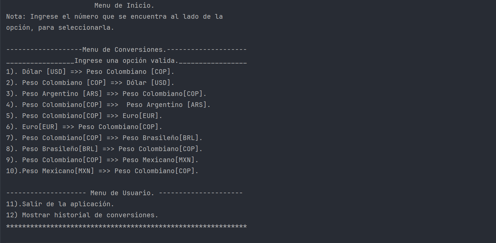
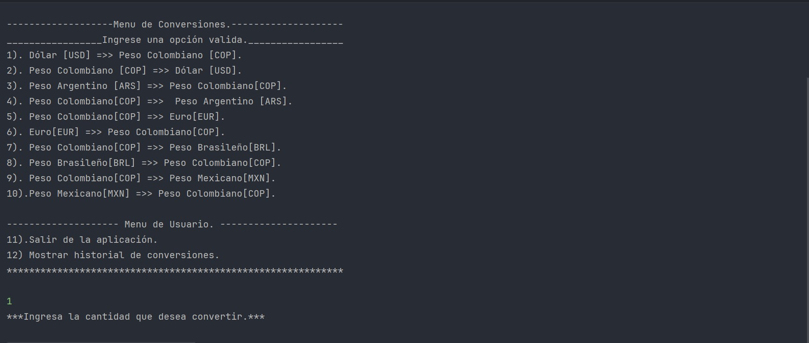
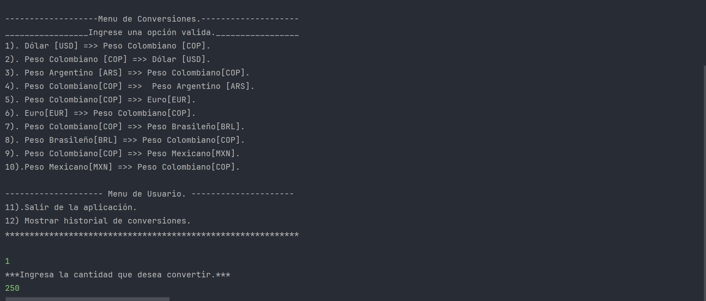
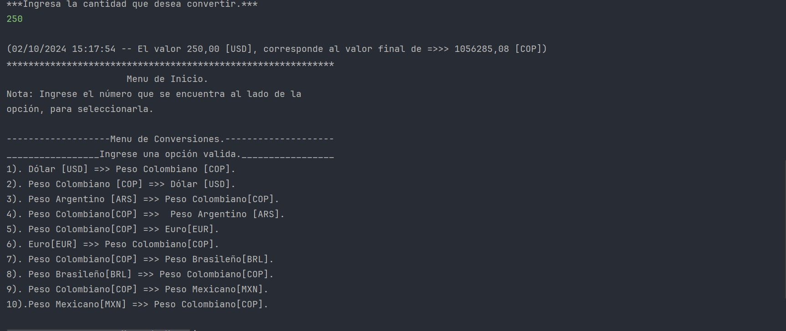
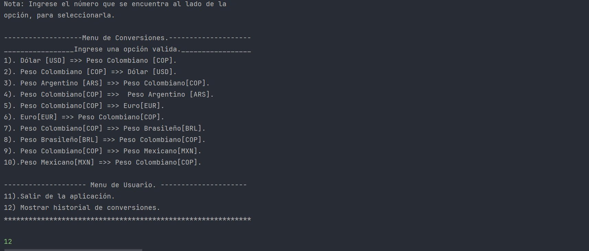
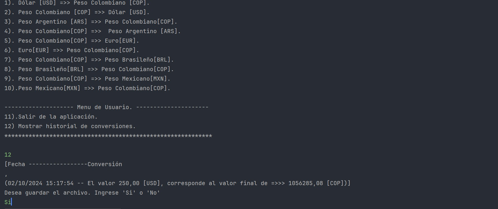
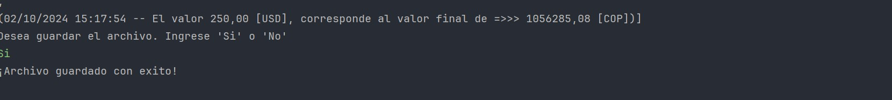
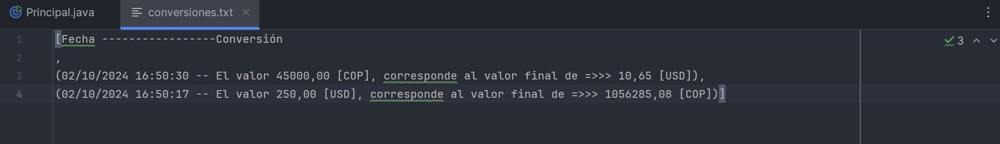

# Challenge Conversor De Monedas🌍💻💵💷💰
---
#### Autores: Juan Palacio. 👨🏽‍💻👨🏽‍💻🖥️ 
#### Para Alura Latam. 📘🌏
***
## Tabla de contenido
1. [Descripción del proyecto](#descripcion)
2. [Objetivos del proyecto](#objetivos)
3. [Especificaciones y componentes del proyecto](#espe)
4. [Elementos del proyecto](#elementos)
5. [Ejemplo de uso de la aplicación](#5-ejemplo-de-uso-de-la-aplicación)
---

### 1. Descripcion del proyecto 
---
Esta aplicación es diseñada para convertir diferentes divisas de diferentes países, pero no solo esto, si necesitas realizar varias conversiones de diferentes monedas, esto lo puedes realizar con nuestra aplicación, el cual ofrece las siguientes ventajas: el uso de esta estas obteniendo.

* 🌍⏱️La tasa de conversión de las divisas se actualiza de manera periódica.
* 🗒️🔎Consulta de tus conversiones en cualquier momento.
* 🗃️⬇️Si lo deseas puedes descargar un archivo con el historial de las conversiones.
* ⚡La aplicación funciona de manera óptima y de fácil uso.

Esta aplicación desarrollada en Java te puede ayudar en apuros, si en algún momento, necesitas convertir de una moneda a otra con la tasa de conversión actual, a cualquier hora del día. Con nuestro conversor lo puedes lograr, además otra ventaja es que es de fácil uso, e intuitiva para que el usuario tenga la mejor experiencia de navegación.

Pruébala y lo comprobaras. 🆙🆙

---
### 2. Objetivos del proyecto 
---
#### 2.1. Construir un conversor de monedas.🧑🏽‍💻
#### 2.2. Implementar un sistema de solicitudes a una API de tasas de cambio.💻
#### 2.3. Manipular datos obtenidos de la API en formato JSON.📄
#### 2.4. Filtrar y mostrar y convertir los valores.🔎
#### 2.5. Implementar una interfaz con el usuario.💬
---
### 3. Especificaciones y componentes del proyecto 
---
Al ejecutar la aplicación el usuario encontrara un menú de inicio el cual cuenta con una instrucción básica de como ingresar la opción deseada. Dos submenús, los cuales son denominados:\
\
3.1. Menú de conversiones: Están 10 opciones, de cambio de moneda para empezar a usar la aplicación y aplicar diferentes tasas de conversión.\

3.2. Menú de usuario: Consta de 2 opciones de elección.
- Salir: Dara por terminada la ejecución del programa.
- Mostrar el historial: Mostrara el historial de sus conversiones. Si al momento de ingresar esta opción no hay ninguna conversión previa, el sistema arrojara un mensaje de que “En el momento no hay conversiones.”

#### Menu de inicio

---

### 4. Elementos del proyecto 
---
Al ejecutar la aplicación nos aparecerá el menú inicial, después vamos a ingresar el numero ‘1’ para seleccionar la primera opción del menú de ejemplo. “Convertir de dólares a pesos colombianos”.\

#### 4.1. Pasos para uso de la aplicación.
###### Ingresar opción.

Luego, Nos aparecerá una opción de ingresar el monto a convertir, ingresamos un monto de 250,00 USD.
###### Ingresar monto a convertir.
 
 
Después de ingresar la cantidad nos aparecerá, el resultado de la conversión de divisa y vuelve a aparecer el menú inicial.
###### Respuesta de la API

Si queremos ver el historial de conversiones, podemos ingresar la opción ‘12’.  Al ingresar este numero nos mostrara el historial de versiones. 
###### Consultar el historial.

Aparecerá un mensaje que indica si desea descargar el archivo.
###### Revisar el historial y descargarlo.

Si la respuesta es ‘sí’, aparecerá un mensaje de archivo guardado con éxito, y un documento llamado ‘conversiones.txt’ alojado en su equipo.

###### Confirmacion de archivo descargado.

###### Archivo .txt

Despues de estos pasos, volvera a iniciar el menu principal y seguir solicitando conversiones de moneda, o si lo desea, en el menu principal ingrese la opcion '11', la cual indica salir de la aplicación.

---

### 5. Ejemplo de uso de la aplicación 
---
A contitnuación se muestra un ejemplo del uso de la aplicación.

###### 
Copyright © 2024 - Desarrollado por Juan Palacio - para Alura 
